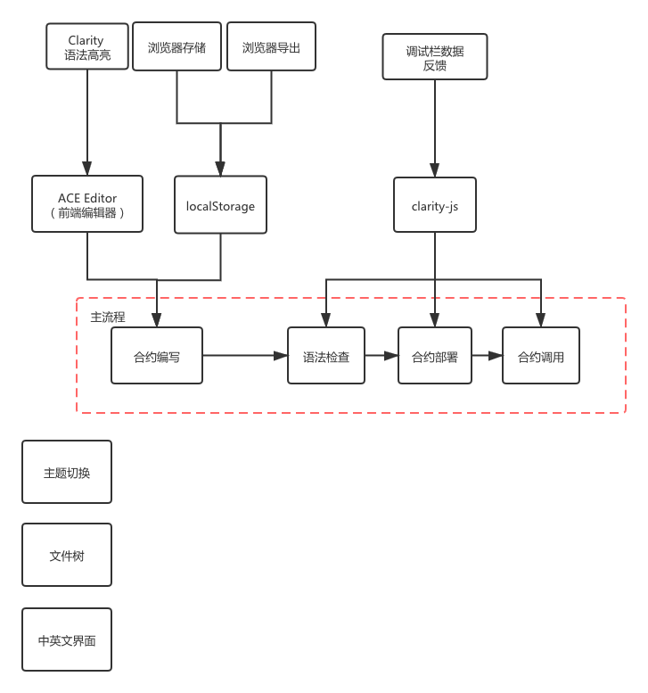

# Clarity-Studio
Clairty-lang Online IDE

功能模块：
- 核心流程：
  - 合约编写
    - 语法高亮
    - 浏览器存储
    - 浏览器导出
  - 语法检查
    - 提示语法错误
  - 合约部署
    - 提示部署成功信息
    - 提示部署失败信息
  - 合约调用
    - 返回调用成功信息
    - 返回调用失败信息
- 其他功能
  - 主题切换
    - 浅色主题
    - 深色主题
  - 文件树系统
  - 中英文界面
  - 多合约调用
